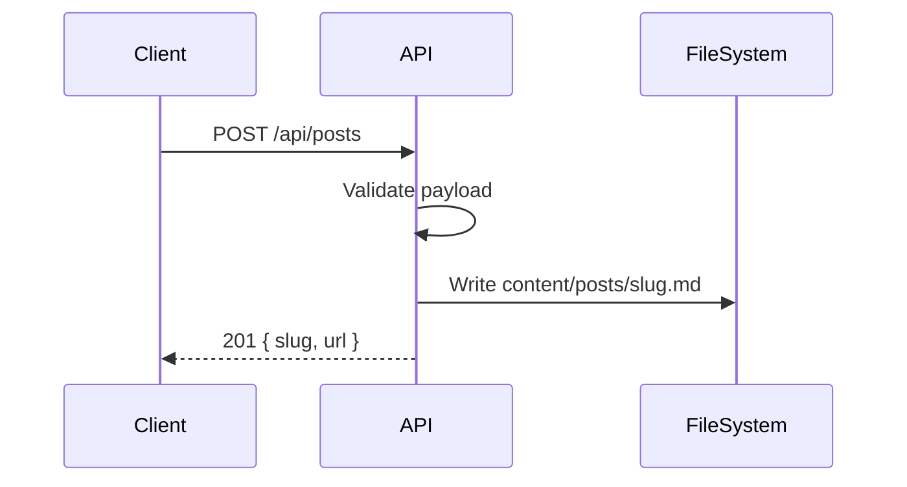

The first release allows the website to read content, not write it. Post creation happens through the backend API so the data shape stays controlled while the reading experience is developed.

## API Shape

```json
{
  "title": "New Post",
  "description": "Short listing summary.",
  "tags": ["api", "notes"],
  "date": "2026-05-05",
  "coverImage": "/uploads/example.png",
  "body": "## Markdown body"
}
```

This creates a Markdown file with front matter and returns a permanent URL tail.


