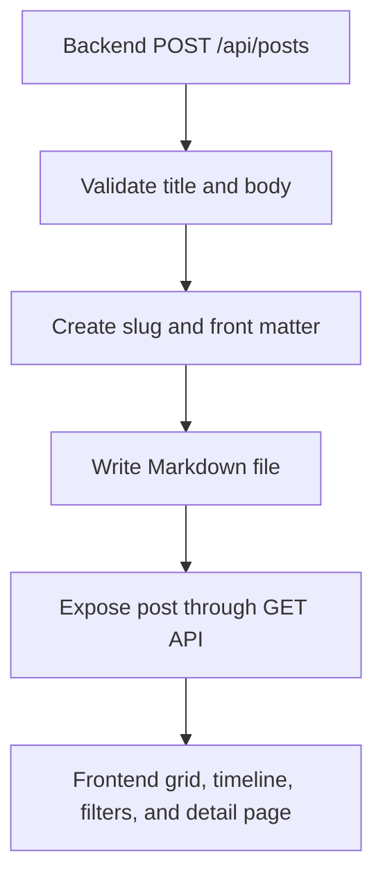
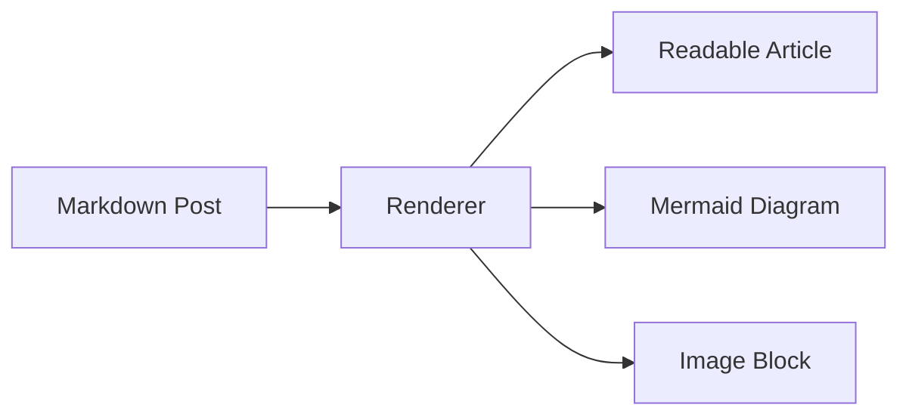

Knowledge Core is a small publishing system for project descriptions that should feel closer to a technical notebook than a marketing website. Each article is written as a Markdown file, stored by the backend, and delivered to the frontend through an API.

The first version keeps publishing intentionally strict. Readers can browse, filter, and open posts in the website, but new posts are created by backend routes only. That keeps the public interface simple while leaving the content model ready for an admin dashboard later.

## Content Model

Every post has structured metadata at the top of the file. Tags are part of the data, so the website can filter by topic without reading the whole article body.

```md
---
title: Knowledge Core Project Description
slug: knowledge-core-project-description
description: A minimal backend-owned Markdown blog.
date: 2026-05-05
tags: ["project", "markdown", "backend", "tailwind"]
coverImage: /uploads/dot-grid-cover.svg
---
```

The body stays plain Markdown. That means the same file can hold essays, diagrams, tables, graph notes, images, and code examples without creating a separate CMS format.

## Publishing Flow



The browser reads the post list from `GET /api/posts` and a single post from `GET /api/posts/:slug`. A post URL uses its slug as the link tail, such as `/posts/knowledge-core-project-description`.

## Frontend Views

The website starts with a grid view for scanning many posts at once. Each tile shows the title, date, description, tags, and the direct post path.

The timeline view changes the same data into a chronological reading trail. It is useful for project logs because it shows how ideas move over time.

Both views share the same filter controls:

| Filter | Purpose |
| --- | --- |
| Text search | Find posts by title, description, or tag |
| Tag filter | Focus the list on one topic |
| View toggle | Switch between grid and timeline |

## Diagram, Graph, And Image Support

Markdown rendering supports code blocks, images, tables, and Mermaid diagrams. This makes the blog useful for explaining architecture and system relationships without needing custom page code for every article.




## Chart Support

The blog can also render popular chart types from Markdown. Use a fenced `chart` block with JSON data. The first version supports `bar`, `line`, and `pie`, styled as minimal black-and-white charts so they match the rest of the interface.

```chart
{
  "type": "bar",
  "title": "Blog View Coverage",
  "description": "Example data rendered from Markdown",
  "xKey": "view",
  "yKey": "score",
  "data": [
    { "view": "Grid", "score": 92 },
    { "view": "Timeline", "score": 84 },
    { "view": "Detail", "score": 96 },
    { "view": "Diagram", "score": 88 },
    { "view": "Chart", "score": 90 }
  ]
}
```

The same structure can become a line chart by changing `type` to `line`, or a donut-style chart by changing it to `pie`.

## Design Direction

The interface is intentionally minimal: white background, black typography, black borders, and a fine dot field. Objects use sharp corners first, so the UI feels direct and system-like instead of soft or decorative.

Tailwind owns the layout and interaction styling. Custom CSS is kept focused on Markdown prose because article content needs predictable typography, table borders, image framing, diagram containers, and chart containers.

The selected font pair is Inter with JetBrains Mono. It keeps the website minimal, technical, and readable without adding extra visual noise.
